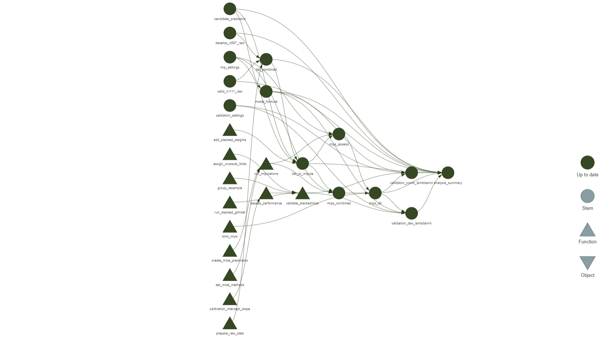

# Development and validation of a prediction model for failure of the transfemoral approach of endovascular treatment for large vessel occlusion acute ischemic stroke

[](https://doi.org/10.1159/000535758)

**Authors**: Ghislaine Holswilder, Edouard F. Bonneville, Julia van Hees, Stijn W. F. Kremer, Hendrikus J. A. van Os, Aad van der Lugt, Wouter J. Schonewille, Geert J. Lycklama à Nijeholt, Charles B. L. M. Majoie, Bart J. Emmer, Nyika D. Kruyt, Marieke J. H. Wermer, Marianne A. A. van Walderveen, on behalf of the MR CLEAN Registry investigators

## Abstract

Introduction: Extracranial vascular characteristics determine the accessibility of the large vessel intracranial occlusion for endovascular treatment (EVT) in acute ischemic stroke. We developed and validated a prediction model for failure of the transfemoral approach to aid clinical decision making regarding EVT. Methods: A prediction model was developed from data of patients included in the Dutch multicenter MR CLEAN Registry (March 18th 2014 until June 15th 2016) with penalized logistic regression. Predictor variables were available prior to the EVT procedure and included age, hypertension and extracranial vascular characteristics assessed on baseline CTA. The prediction model was internally validated, temporally validated within a second MR CLEAN Registry cohort (June 15th 2016 until November 1st 2017) and updated by re-estimating the coefficients using the combined cohort. Results: Failure of the transfemoral approach occurred in 7% of patients, in both cohorts (derivation cohort: n=887, median age 71 years, interquartile range [IQR] 60-80, 52% men; validation cohort: n=1111, median age 73 years, IQR 62-81, 51% men). The prediction model had a c-statistic of 0.81 (95%CI: 0.76-0.86) in the derivation cohort, 0.69 (95%CI: 0.62-0.75) at temporal validation, and 0.75 (95%CI: 0.71-0.79) in the final prediction model, with the following penalized β-coefficients for predictors age (per decade): 0.26, hypertension: -0.16, severe aortic arch elongation: 1.45, bovine aortic arch: 0.44, elongation of the supra-aortic arteries: 0.72, cervical ICA elongation: 0.44, and high-grade stenosis of the cervical ICA: 0.78. Conclusion: Our prediction model showed good performance for prediction of failure to reach the intracranial occlusion by the transfemoral approach.

## Usage

The analyses for this article are structured using the [`{targets}`](https://github.com/ropensci/targets) R package. Code for the individual targets are in the [_targets.R](./_targets.R) file.



Given the data, reproduce the analysis using

``` r
targets::tar_make()

# Or to use parallel computation:
#targets::tar_make_future(workers = future::availableCores())
```

which produces the [article-results.md](./analysis/article-results.md) file with the results and figures used in the manuscript. Furthermore, the project uses [`{renv}`](https://rstudio.github.io/renv/articles/renv.html) to track its R package dependencies.