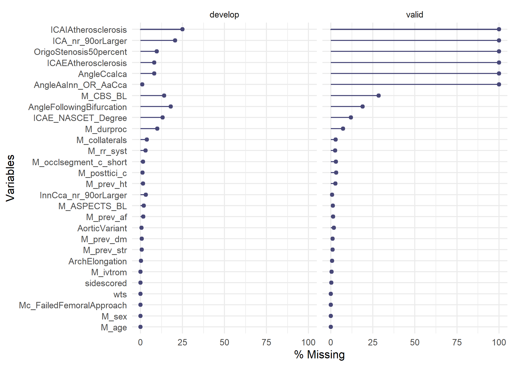
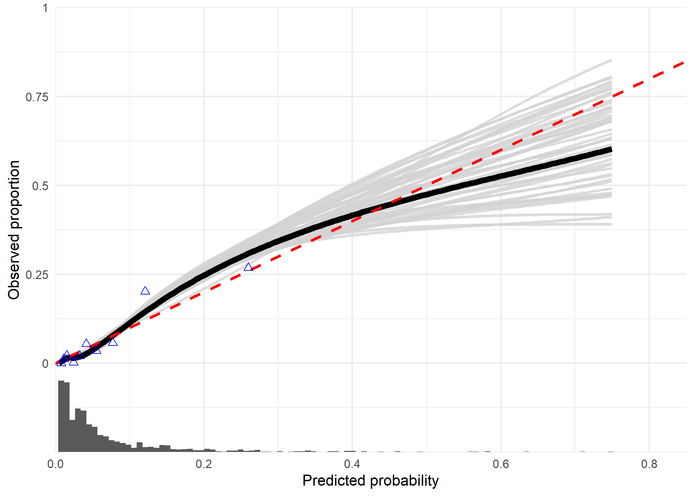
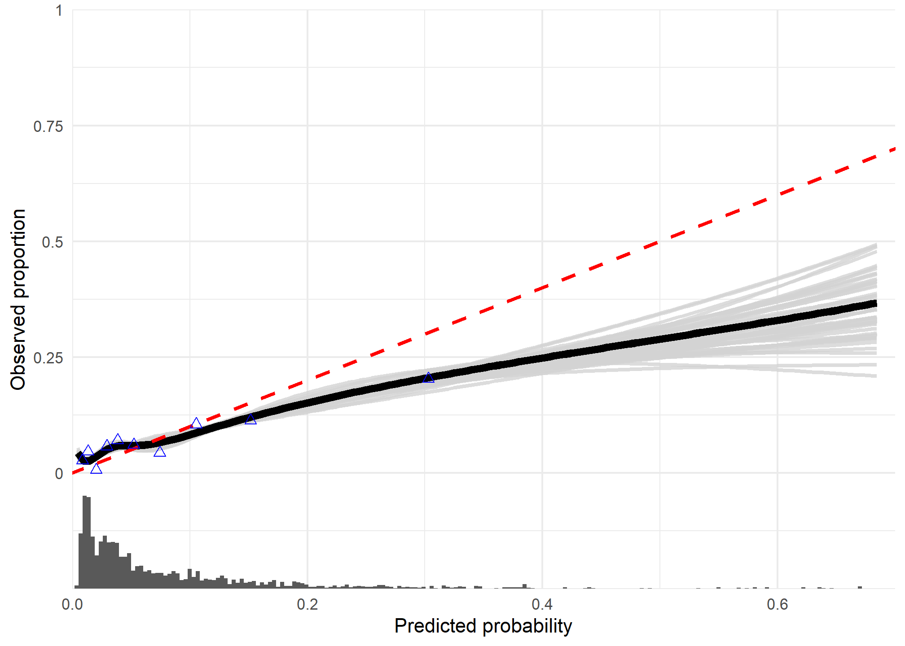
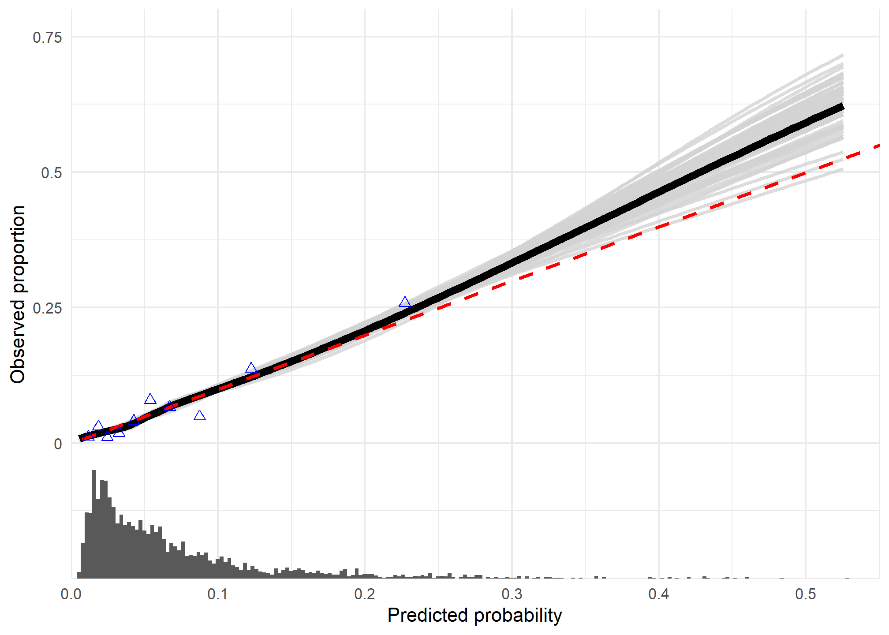
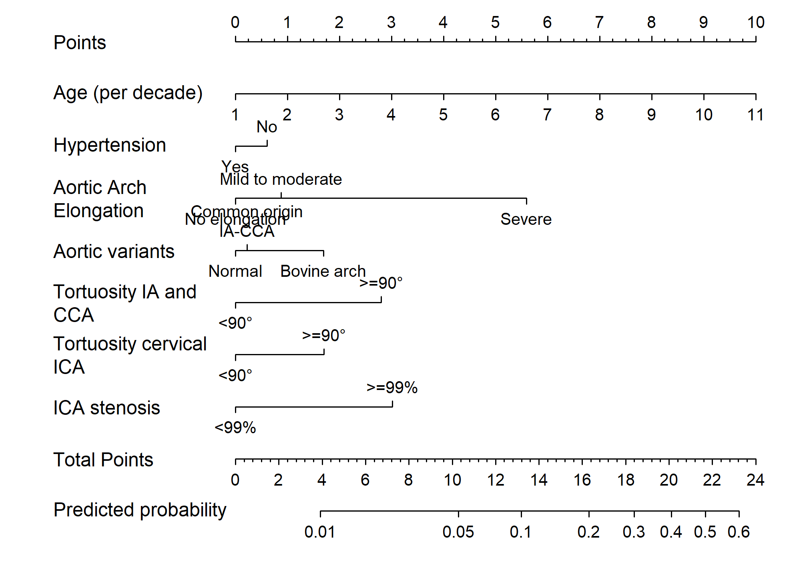

## Descriptives

### Table 1

For continuous variables:


|                                |develop        |valid          |p      |test |
|:-------------------------------|:--------------|:--------------|:------|:----|
|n                               |887            |1111           |       |     |
|M_age (mean (SD))               |68.72 (14.40)  |70.59 (14.07)  |0.004  |     |
|M_rr_syst (mean (SD))           |150.16 (24.98) |149.40 (24.89) |0.504  |     |
|M_NIHSS_BL (mean (SD))          |15.63 (6.03)   |15.53 (6.38)   |0.710  |     |
|M_togroin (mean (SD))           |213.93 (72.41) |190.97 (72.80) |<0.001 |     |
|M_durproc (mean (SD))           |70.10 (33.77)  |63.98 (32.80)  |<0.001 |     |
|M_NIHSS_FU (mean (SD))          |12.03 (9.16)   |10.82 (8.20)   |0.003  |     |
|AngleAaInn_OR_AaCca (mean (SD)) |65.76 (16.11)  |NaN (NA)       |NA     |     |
|ICAE_NASCET_Degree (mean (SD))  |19.19 (33.29)  |25.50 (38.99)  |<0.001 |     |

For categorical variables:


|                                                        |develop    |valid        |p      |test |
|:-------------------------------------------------------|:----------|:------------|:------|:----|
|n                                                       |887        |1111         |       |     |
|M_mrs_rev_orig = 3-6 (%)                                |504 (61.9) |628 ( 59.6)  |0.342  |     |
|dataset = valid (%)                                     |0 ( 0.0)   |1111 (100.0) |<0.001 |     |
|Mc_FailedFemoralApproach = failure (%)                  |59 ( 6.7)  |81 (  7.3)   |0.640  |     |
|M_sex = Male (%)                                        |461 (52.0) |571 ( 51.4)  |0.832  |     |
|M_prev_str = Yes (%)                                    |159 (18.0) |182 ( 16.5)  |0.412  |     |
|M_prev_dm = Yes (%)                                     |136 (15.5) |165 ( 15.0)  |0.828  |     |
|M_prev_ht = Yes (%)                                     |446 (51.0) |601 ( 55.6)  |0.049  |     |
|M_prev_af = Yes (%)                                     |202 (23.2) |287 ( 26.2)  |0.140  |     |
|M_premrs = 1 (%)                                        |286 (32.8) |346 ( 32.0)  |0.723  |     |
|M_ivtrom = Yes (%)                                      |683 (77.0) |813 ( 73.5)  |0.082  |     |
|Mc_pretici_short = >=1 (%)                              |83 (10.4)  |176 ( 16.5)  |<0.001 |     |
|M_collaterals = >=50 (%)                                |512 (60.0) |607 ( 56.3)  |0.105  |     |
|M_ASPECTS_BL = <=7 (%)                                  |256 (29.4) |233 ( 21.2)  |<0.001 |     |
|M_CBS_BL = <=7 (%)                                      |548 (71.9) |507 ( 63.7)  |0.001  |     |
|M_occlsegment_c_short (%)                               |           |             |0.181  |     |
|Intracranial ICA                                        |52 ( 5.9)  |52 (  4.8)   |       |     |
|ICA-T                                                   |203 (23.2) |229 ( 21.2)  |       |     |
|M1                                                      |509 (58.2) |630 ( 58.4)  |       |     |
|Other:M3/anterior/M2                                    |110 (12.6) |167 ( 15.5)  |       |     |
|M_posttici_c = 2B-3 (%)                                 |482 (55.0) |704 ( 65.4)  |<0.001 |     |
|ArchElongation (%)                                      |           |             |0.989  |     |
|I                                                       |155 (17.5) |191 ( 17.3)  |       |     |
|II                                                      |561 (63.4) |699 ( 63.4)  |       |     |
|III                                                     |169 (19.1) |213 ( 19.3)  |       |     |
|AorticVariant (%)                                       |           |             |0.001  |     |
|Type A                                                  |654 (74.1) |738 ( 67.6)  |       |     |
|Type B                                                  |123 (13.9) |162 ( 14.8)  |       |     |
|Type C                                                  |105 (11.9) |191 ( 17.5)  |       |     |
|InnCca_nr_90orLarger (%)                                |           |             |0.276  |     |
|0                                                       |521 (60.7) |631 ( 57.2)  |       |     |
|1                                                       |213 (24.8) |285 ( 25.8)  |       |     |
|2                                                       |104 (12.1) |163 ( 14.8)  |       |     |
|3                                                       |21 ( 2.4)  |24 (  2.2)   |       |     |
|AngleFollowingBifurcation = Yes, angle >=90 degrees (%) |125 (17.2) |243 ( 26.9)  |<0.001 |     |
|ICA_nr_90orLarger (%)                                   |           |             |NaN    |     |
|0                                                       |327 (46.4) |0 (  NaN)    |       |     |
|1                                                       |192 (27.2) |0 (  NaN)    |       |     |
|2                                                       |157 (22.3) |0 (  NaN)    |       |     |
|3                                                       |29 ( 4.1)  |0 (  NaN)    |       |     |
|ICAIAtherosclerosis (%)                                 |           |             |NaN    |     |
|No                                                      |190 (28.6) |0 (  NaN)    |       |     |
|Yes, calcified spots                                    |162 (24.4) |0 (  NaN)    |       |     |
|Yes, <50% stenosis                                      |202 (30.4) |0 (  NaN)    |       |     |
|Yes, >=50% stenosis                                     |111 (16.7) |0 (  NaN)    |       |     |
|OrigoStenosis50percent = Origostenosis >= 50% (%)       |14 ( 1.7)  |0 (  NaN)    |NaN    |     |
|ICA_nr_90orLarger_geq1 = 1 (%)                          |378 (53.6) |0 (  NaN)    |NaN    |     |
|ICA_nr_90orLarger_geq2 = 1 (%)                          |186 (26.4) |0 (  NaN)    |NaN    |     |
|ICAE_NASCET_99 = 1 (%)                                  |86 (11.2)  |166 ( 17.0)  |0.001  |     |
|InnCca_90orLarger_geq1 = 1 (%)                          |338 (39.3) |472 ( 42.8)  |0.136  |     |
|InnCca_90orLarger_geq2 = 1 (%)                          |125 (14.6) |187 ( 17.0)  |0.167  |     |
|ICAI_stenosis50 = 1 (%)                                 |111 (16.7) |0 (  NaN)    |NaN    |     |
|AngleAaInn_OR_AaCca_dich45 = 1 (%)                      |70 ( 8.0)  |0 (  NaN)    |NaN    |     |

### Missing data summaries 


Complete-case analysis (using predictors in the prediction model) results in:

- 72.94 % complete cases in the development data
- 73.27 % complete cases in the validation data
- 73.12 % complete cases in the combined data

The next plots look at the combinations of variables missings and their frequencies in the development and validation sets respectively:



|dataset |variable                  | n_miss| pct_miss|
|:-------|:-------------------------|------:|--------:|
|develop |ICAIAtherosclerosis       |    222|    25.03|
|develop |ICA_nr_90orLarger         |    182|    20.52|
|develop |AngleFollowingBifurcation |    160|    18.04|
|develop |M_CBS_BL                  |    125|    14.09|
|develop |ICAE_NASCET_Degree        |    117|    13.19|
|develop |M_durproc                 |     89|    10.03|
|develop |OrigoStenosis50percent    |     86|     9.70|
|develop |AngleCcaIca               |     72|     8.12|
|develop |ICAEAtherosclerosis       |     72|     8.12|
|develop |M_collaterals             |     34|     3.83|
|develop |InnCca_nr_90orLarger      |     28|     3.16|
|develop |M_rr_syst                 |     27|     3.04|
|develop |M_ASPECTS_BL              |     17|     1.92|
|develop |M_prev_af                 |     15|     1.69|
|develop |M_prev_ht                 |     13|     1.47|
|develop |M_occlsegment_c_short     |     13|     1.47|
|develop |M_posttici_c              |     10|     1.13|
|develop |AngleAaInn_OR_AaCca       |      9|     1.01|
|develop |M_prev_dm                 |      7|     0.79|
|develop |M_prev_str                |      6|     0.68|
|develop |AorticVariant             |      5|     0.56|
|develop |ArchElongation            |      2|     0.23|
|develop |Mc_FailedFemoralApproach  |      0|     0.00|
|develop |M_age                     |      0|     0.00|
|develop |M_sex                     |      0|     0.00|
|develop |M_ivtrom                  |      0|     0.00|
|develop |sidescored                |      0|     0.00|
|develop |wts                       |      0|     0.00|
|valid   |AngleAaInn_OR_AaCca       |   1111|   100.00|
|valid   |AngleCcaIca               |   1111|   100.00|
|valid   |ICA_nr_90orLarger         |   1111|   100.00|
|valid   |ICAEAtherosclerosis       |   1111|   100.00|
|valid   |ICAIAtherosclerosis       |   1111|   100.00|
|valid   |OrigoStenosis50percent    |   1111|   100.00|
|valid   |M_CBS_BL                  |    315|    28.35|
|valid   |AngleFollowingBifurcation |    209|    18.81|
|valid   |ICAE_NASCET_Degree        |    133|    11.97|
|valid   |M_durproc                 |     81|     7.29|
|valid   |M_posttici_c              |     35|     3.15|
|valid   |M_occlsegment_c_short     |     33|     2.97|
|valid   |M_collaterals             |     32|     2.88|
|valid   |M_prev_ht                 |     30|     2.70|
|valid   |M_rr_syst                 |     28|     2.52|
|valid   |AorticVariant             |     20|     1.80|
|valid   |M_prev_af                 |     14|     1.26|
|valid   |M_ASPECTS_BL              |     13|     1.17|
|valid   |M_prev_str                |     11|     0.99|
|valid   |M_prev_dm                 |     11|     0.99|
|valid   |ArchElongation            |      8|     0.72|
|valid   |InnCca_nr_90orLarger      |      8|     0.72|
|valid   |M_ivtrom                  |      5|     0.45|
|valid   |sidescored                |      2|     0.18|
|valid   |Mc_FailedFemoralApproach  |      0|     0.00|
|valid   |M_age                     |      0|     0.00|
|valid   |M_sex                     |      0|     0.00|
|valid   |wts                       |      0|     0.00|

<!-- (Naniar/JointAI summaries/VIM) -->

## Internal validation development set

Coefficients of the (penalized, with Ridge) prediction model built using the development data:


|                                                 | Coefficients|
|:------------------------------------------------|------------:|
|(Intercept)                                      |       -5.777|
|M_age                                            |        0.253|
|M_prev_htYes                                     |       -0.543|
|AorticVariantType B                              |        0.426|
|AorticVariantType C                              |        0.941|
|ArchElongationII                                 |       -0.066|
|ArchElongationIII                                |        1.328|
|AngleFollowingBifurcationYes, angle >=90 degrees |        0.824|
|InnCca_nr_90orLargergeq_1                        |        1.004|
|ICAE_NASCET_Degreegeq_99                         |        1.337|

Bootstrap-based internal validation, optimism-corrected performance of this model:


|measure   |value                |
|:---------|:--------------------|
|auc       |0.812 [0.762;0.857]  |
|intercept |0.045 [-0.236;0.332] |
|slope     |1.053 [0.839;1.292]  |

Calibration plot, reflecting apparent performance:



## External validation

<div class="kable-table">

|measure   |value                  |
|:---------|:----------------------|
|auc       |0.686 [0.62, 0.745]    |
|intercept |-0.106 [-0.348, 0.136] |
|slope     |0.583 [0.383, 0.783]   |

</div>

At external validation, the calibration plot shows that there is quite some overestimation of risks in the validation set.

## Model update: combined cohort re-estimation

### Interaction-by-cohort (unpenalized)

See [Balmaña, Stockwell, Steyerberg et al. (2006)](https://jamanetwork.com/journals/jama/article-abstract/203427). Here, we use standard (unpenalized) logistics regression to test for differences between the development and validation set in terms of multivariable model coefficients.

The log odds table of coefficient, and the p-values for the interaction:


|term                                             | development| interaction| pval_interaction| validation|
|:------------------------------------------------|-----------:|-----------:|----------------:|----------:|
|(Intercept)                                      |      -6.522|       0.764|            0.591|     -5.758|
|M_age                                            |       0.295|      -0.057|            0.764|      0.237|
|M_prev_htYes                                     |      -0.721|       0.839|            0.037|      0.118|
|AorticVariantType B                              |       0.708|      -0.973|            0.106|     -0.265|
|AorticVariantType C                              |       1.175|      -1.055|            0.034|      0.121|
|ArchElongationII                                 |       0.229|       0.437|            0.561|      0.666|
|ArchElongationIII                                |       1.768|       0.039|            0.962|      1.806|
|AngleFollowingBifurcationYes, angle >=90 degrees |       0.874|      -0.651|            0.158|      0.222|
|InnCca_nr_90orLargergeq_1                        |       1.184|      -0.619|            0.142|      0.565|
|ICAE_NASCET_Degreegeq_99                         |       1.351|      -0.828|            0.099|      0.522|

In the format of Table 4 from the article mentioned above (with odds ratios):


|Term                                             |Development cohort    |Validation cohort    |Combined cohort       |
|:------------------------------------------------|:---------------------|:--------------------|:---------------------|
|(Intercept)                                      |0.001 [0, 0.013]      |0.003 [0.001, 0.019] |0.003 [0.001, 0.01]   |
|M_age                                            |1.342 [1.001, 1.801]  |1.268 [1.004, 1.601] |1.296 [1.083, 1.551]  |
|M_prev_htYes                                     |0.486 [0.264, 0.894]  |1.125 [0.678, 1.866] |0.818 [0.561, 1.193]  |
|AorticVariantType B                              |2.03 [0.839, 4.912]   |0.768 [0.35, 1.681]  |1.123 [0.632, 1.996]  |
|AorticVariantType C                              |3.239 [1.548, 6.774]  |1.128 [0.597, 2.133] |1.664 [1.039, 2.666]  |
|ArchElongationII                                 |1.257 [0.443, 3.567]  |1.946 [0.684, 5.541] |1.583 [0.768, 3.264]  |
|ArchElongationIII                                |5.858 [1.895, 18.109] |6.088 [2.04, 18.171] |5.713 [2.661, 12.266] |
|AngleFollowingBifurcationYes, angle >=90 degrees |2.395 [1.175, 4.883]  |1.249 [0.703, 2.218] |1.569 [1.008, 2.443]  |
|InnCca_nr_90orLargergeq_1                        |3.269 [1.682, 6.352]  |1.76 [1.078, 2.873]  |2.208 [1.496, 3.26]   |
|ICAE_NASCET_Degreegeq_99                         |3.859 [1.795, 8.299]  |1.686 [0.912, 3.115] |2.318 [1.456, 3.689]  |

### Internal validation combined cohort


|                                                 | Coefficients|
|:------------------------------------------------|------------:|
|(Intercept)                                      |       -5.709|
|M_age                                            |        0.259|
|M_prev_htYes                                     |       -0.156|
|AorticVariantType B                              |        0.057|
|AorticVariantType C                              |        0.438|
|ArchElongationII                                 |        0.227|
|ArchElongationIII                                |        1.448|
|AngleFollowingBifurcationYes, angle >=90 degrees |        0.439|
|InnCca_nr_90orLargergeq_1                        |        0.724|
|ICAE_NASCET_Degreegeq_99                         |        0.780|


|measure   |value                |
|:---------|:--------------------|
|auc       |0.747 [0.711;0.79]   |
|intercept |0.014 [-0.146;0.203] |
|slope     |1.02 [0.857;1.256]   |



### Nomogram



```
## Points per unit of linear predictor: NaN 
## Linear predictor units per point   : NaN 
## 
## 
##  Age (per decade) Points
##   1                0    
##   2                1    
##   3                2    
##   4                3    
##   5                4    
##   6                5    
##   7                6    
##   8                7    
##   9                8    
##  10                9    
##  11               10    
## 
## 
##  Hypertension Points
##  No           0.6   
##  Yes          0.0   
## 
## 
##  Aortic Arch Elongation Points
##  No elongation          0.00  
##  Mild to moderate       0.88  
##  Severe                 5.60  
## 
## 
##  Aortic variants       Points
##  Normal                0.00  
##  Common origin\nIA-CCA 0.22  
##  Bovine arch           1.69  
## 
## 
##  Tortuosity IA and CCA Points
##  <90°                  0.0   
##  >=90°                 2.8   
## 
## 
##  Tortuosity cervical ICA Points
##  <90°                    0.0   
##  >=90°                   1.7   
## 
## 
##  ICA stenosis Points
##  <99%         0.00  
##  >=99%        3.02  
## 
## 
##  Total Points Predicted probability
##          3.91                  0.01
##         10.29                  0.05
##         13.18                  0.10
##         16.31                  0.20
##         18.40                  0.30
##         20.10                  0.40
##         21.67                  0.50
##         23.24                  0.60
```


