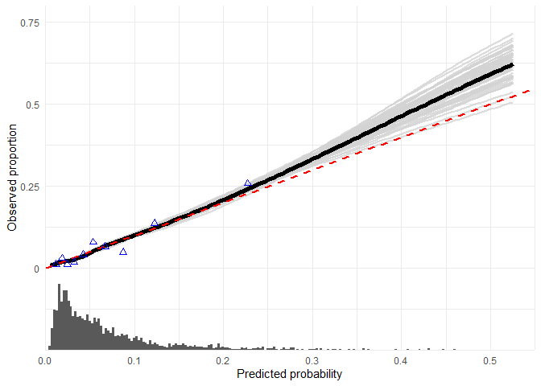

## Descriptives

### Table 1

For continuous variables:


```{=html}
<div id="htmlwidget-deb011fd5c19072f3155" style="width:100%;height:auto;" class="datatables html-widget"></div>
<script type="application/json" data-for="htmlwidget-deb011fd5c19072f3155">{"x":{"filter":"none","vertical":false,"extensions":["Buttons"],"data":[["n","M_age (median [IQR])","M_rr_syst (median [IQR])","M_NIHSS_BL (median [IQR])","M_togroin (median [IQR])","M_durproc (median [IQR])","M_NIHSS_FU (median [IQR])","AngleAaInn_OR_AaCca (median [IQR])","ICAE_NASCET_Degree (median [IQR])"],["887","71.00 [60.00, 80.00]","150.00 [131.75, 166.00]","16.00 [12.00, 20.00]","210.00 [159.50, 265.00]","65.00 [45.00, 90.00]","11.00 [4.00, 18.00]","64.80 [55.40, 75.30]","0.00 [0.00, 27.45]"],["1111","72.89 [62.30, 80.89]","148.00 [131.00, 164.00]","16.00 [11.00, 20.00]","180.00 [136.00, 230.00]","57.00 [40.00, 83.00]","10.00 [4.00, 16.00]","NA [NA, NA]","0.00 [0.00, 46.83]"],["","0.004","0.400","0.838","&lt;0.001","&lt;0.001","0.013","NA","0.084"],["","nonnorm","nonnorm","nonnorm","nonnorm","nonnorm","nonnorm","nonnorm","nonnorm"]],"container":"<table class=\"display\">\n  <thead>\n    <tr>\n      <th> <\/th>\n      <th>develop<\/th>\n      <th>valid<\/th>\n      <th>p<\/th>\n      <th>test<\/th>\n    <\/tr>\n  <\/thead>\n<\/table>","options":{"dom":"Blfrtip","buttons":["csv","excel","pdf"],"lengthMenu":[[10,25,50,-1],["10","25","50","All"]],"columnDefs":[{"orderable":false,"targets":0}],"order":[],"autoWidth":false,"orderClasses":false}},"evals":[],"jsHooks":[]}</script>
```

For categorical variables:


```{=html}
<div id="htmlwidget-025ff3a60996206ca6f8" style="width:100%;height:auto;" class="datatables html-widget"></div>
<script type="application/json" data-for="htmlwidget-025ff3a60996206ca6f8">{"x":{"filter":"none","vertical":false,"extensions":["Buttons"],"data":[["n","M_mrs_rev_orig = 3-6 (%)","dataset = valid (%)","Mc_FailedFemoralApproach = failure (%)","M_sex = Male (%)","M_prev_str = Yes (%)","M_prev_dm = Yes (%)","M_prev_ht = Yes (%)","M_prev_af = Yes (%)","M_premrs = 1 (%)","M_ivtrom = Yes (%)","Mc_pretici_short = &gt;=1 (%)","M_collaterals = &gt;=50 (%)","M_ASPECTS_BL = &lt;=7 (%)","M_CBS_BL = &lt;=7 (%)","M_occlsegment_c_short (%)","   Intracranial ICA","   ICA-T","   M1","   Other:M3/anterior/M2","M_posttici_c = 2B-3 (%)","ArchElongation (%)","   I","   II","   III","AorticVariant (%)","   Type A","   Type B","   Type C","InnCca_nr_90orLarger (%)","   0","   1","   2","   3","AngleFollowingBifurcation = Yes, angle &gt;=90 degrees (%)","ICA_nr_90orLarger (%)","   0","   1","   2","   3","ICAIAtherosclerosis (%)","   No","   Yes, calcified spots","   Yes, &lt;50% stenosis","   Yes, &gt;=50% stenosis","OrigoStenosis50percent = Origostenosis &gt;= 50% (%)","ICA_nr_90orLarger_geq1 = 1 (%)","ICA_nr_90orLarger_geq2 = 1 (%)","ICAE_NASCET_99 = 1 (%)","InnCca_90orLarger_geq1 = 1 (%)","InnCca_90orLarger_geq2 = 1 (%)","ICAI_stenosis50 = 1 (%)","AngleAaInn_OR_AaCca_dich45 = 1 (%)"],["887","504 (61.9)","0 (0.0)","59 (6.7)","461 (52.0)","159 (18.0)","136 (15.5)","446 (51.0)","202 (23.2)","286 (32.8)","683 (77.0)","83 (10.4)","512 (60.0)","256 (29.4)","548 (71.9)","","52 (5.9)","203 (23.2)","509 (58.2)","110 (12.6)","482 (55.0)","","155 (17.5)","561 (63.4)","169 (19.1)","","654 (74.1)","123 (13.9)","105 (11.9)","","521 (60.7)","213 (24.8)","104 (12.1)","21 (2.4)","125 (17.2)","","327 (46.4)","192 (27.2)","157 (22.3)","29 (4.1)","","190 (28.6)","162 (24.4)","202 (30.4)","111 (16.7)","14 (1.7)","378 (53.6)","186 (26.4)","86 (11.2)","338 (39.3)","125 (14.6)","111 (16.7)","70 (8.0)"],["1111","628 (59.6)","1111 (100.0)","81 (7.3)","571 (51.4)","182 (16.5)","165 (15.0)","601 (55.6)","287 (26.2)","346 (32.0)","813 (73.5)","176 (16.5)","607 (56.3)","233 (21.2)","507 (63.7)","","52 (4.8)","229 (21.2)","630 (58.4)","167 (15.5)","704 (65.4)","","191 (17.3)","699 (63.4)","213 (19.3)","","738 (67.6)","162 (14.8)","191 (17.5)","","631 (57.2)","285 (25.8)","163 (14.8)","24 (2.2)","243 (26.9)","","0 (NaN)","0 (NaN)","0 (NaN)","0 (NaN)","","0 (NaN)","0 (NaN)","0 (NaN)","0 (NaN)","0 (NaN)","0 (NaN)","0 (NaN)","166 (17.0)","472 (42.8)","187 (17.0)","0 (NaN)","0 (NaN)"],["","0.342","&lt;0.001","0.640","0.832","0.412","0.828","0.049","0.140","0.723","0.082","&lt;0.001","0.105","&lt;0.001","0.001","0.181","","","","","&lt;0.001","0.989","","","","0.001","","","","0.276","","","","","&lt;0.001","NaN","","","","","NaN","","","","","NaN","NaN","NaN","0.001","0.136","0.167","NaN","NaN"],["","","","","","","","","","","","","","","","","","","","","","","","","","","","","","","","","","","","","","","","","","","","","","","","","","","","",""]],"container":"<table class=\"display\">\n  <thead>\n    <tr>\n      <th> <\/th>\n      <th>develop<\/th>\n      <th>valid<\/th>\n      <th>p<\/th>\n      <th>test<\/th>\n    <\/tr>\n  <\/thead>\n<\/table>","options":{"dom":"Blfrtip","buttons":["csv","excel","pdf"],"lengthMenu":[[10,25,50,-1],["10","25","50","All"]],"columnDefs":[{"orderable":false,"targets":0}],"order":[],"autoWidth":false,"orderClasses":false}},"evals":[],"jsHooks":[]}</script>
```

### Missing data summaries 


Complete-case analysis (using predictors in the prediction model) results in:

- 72.94 % complete cases in the development data
- 73.27 % complete cases in the validation data
- 73.12 % complete cases in the combined data

The next plots look at the combinations of variables missings and their frequencies in the development and validation sets respectively:


```{=html}
<div id="htmlwidget-0b5753301c261732abfd" style="width:100%;height:auto;" class="datatables html-widget"></div>
<script type="application/json" data-for="htmlwidget-0b5753301c261732abfd">{"x":{"filter":"none","vertical":false,"extensions":["Buttons"],"data":[["1","2","3","4","5","6","7","8","9","10","11","12","13","14","15","16","17","18","19","20","21","22","23","24","25","26","27","28","29","30","31","32","33","34","35","36","37","38","39","40","41","42","43","44","45","46","47","48","49","50","51","52","53","54","55","56"],["develop","develop","develop","develop","develop","develop","develop","develop","develop","develop","develop","develop","develop","develop","develop","develop","develop","develop","develop","develop","develop","develop","develop","develop","develop","develop","develop","develop","valid","valid","valid","valid","valid","valid","valid","valid","valid","valid","valid","valid","valid","valid","valid","valid","valid","valid","valid","valid","valid","valid","valid","valid","valid","valid","valid","valid"],["ICAIAtherosclerosis","ICA_nr_90orLarger","AngleFollowingBifurcation","M_CBS_BL","ICAE_NASCET_Degree","M_durproc","OrigoStenosis50percent","AngleCcaIca","ICAEAtherosclerosis","M_collaterals","InnCca_nr_90orLarger","M_rr_syst","M_ASPECTS_BL","M_prev_af","M_prev_ht","M_occlsegment_c_short","M_posttici_c","AngleAaInn_OR_AaCca","M_prev_dm","M_prev_str","AorticVariant","ArchElongation","Mc_FailedFemoralApproach","M_age","M_sex","M_ivtrom","sidescored","wts","AngleAaInn_OR_AaCca","AngleCcaIca","ICA_nr_90orLarger","ICAEAtherosclerosis","ICAIAtherosclerosis","OrigoStenosis50percent","M_CBS_BL","AngleFollowingBifurcation","ICAE_NASCET_Degree","M_durproc","M_posttici_c","M_occlsegment_c_short","M_collaterals","M_prev_ht","M_rr_syst","AorticVariant","M_prev_af","M_ASPECTS_BL","M_prev_str","M_prev_dm","ArchElongation","InnCca_nr_90orLarger","M_ivtrom","sidescored","Mc_FailedFemoralApproach","M_age","M_sex","wts"],[222,182,160,125,117,89,86,72,72,34,28,27,17,15,13,13,10,9,7,6,5,2,0,0,0,0,0,0,1111,1111,1111,1111,1111,1111,315,209,133,81,35,33,32,30,28,20,14,13,11,11,8,8,5,2,0,0,0,0],[25.03,20.52,18.04,14.09,13.19,10.03,9.7,8.12,8.12,3.83,3.16,3.04,1.92,1.69,1.47,1.47,1.13,1.01,0.79,0.68,0.56,0.23,0,0,0,0,0,0,100,100,100,100,100,100,28.35,18.81,11.97,7.29,3.15,2.97,2.88,2.7,2.52,1.8,1.26,1.17,0.99,0.99,0.72,0.72,0.45,0.18,0,0,0,0]],"container":"<table class=\"display\">\n  <thead>\n    <tr>\n      <th> <\/th>\n      <th>dataset<\/th>\n      <th>variable<\/th>\n      <th>n_miss<\/th>\n      <th>pct_miss<\/th>\n    <\/tr>\n  <\/thead>\n<\/table>","options":{"dom":"Blfrtip","buttons":["csv","excel","pdf"],"lengthMenu":[[10,25,50,-1],["10","25","50","All"]],"columnDefs":[{"className":"dt-right","targets":[3,4]},{"orderable":false,"targets":0}],"order":[],"autoWidth":false,"orderClasses":false}},"evals":[],"jsHooks":[]}</script>
```

<!-- (Naniar/JointAI summaries/VIM) -->

## Internal validation development set

Coefficients of the (penalized, with Ridge) prediction model built using the development data:


```{=html}
<div id="htmlwidget-9d949ce1ec7e17d5a792" style="width:100%;height:auto;" class="datatables html-widget"></div>
<script type="application/json" data-for="htmlwidget-9d949ce1ec7e17d5a792">{"x":{"filter":"none","vertical":false,"extensions":["Buttons"],"data":[["(Intercept)","M_age","M_prev_htYes","AorticVariantType B","AorticVariantType C","ArchElongationII","ArchElongationIII","AngleFollowingBifurcationYes, angle &gt;=90 degrees","InnCca_nr_90orLargergeq_1","ICAE_NASCET_Degreegeq_99"],[-5.777,0.253,-0.543,0.426,0.941,-0.066,1.328,0.824,1.004,1.337]],"container":"<table class=\"display\">\n  <thead>\n    <tr>\n      <th> <\/th>\n      <th>Coefficients<\/th>\n    <\/tr>\n  <\/thead>\n<\/table>","options":{"dom":"Blfrtip","buttons":["csv","excel","pdf"],"lengthMenu":[[10,25,50,-1],["10","25","50","All"]],"columnDefs":[{"className":"dt-right","targets":1},{"orderable":false,"targets":0}],"order":[],"autoWidth":false,"orderClasses":false}},"evals":[],"jsHooks":[]}</script>
```

Bootstrap-based internal validation, optimism-corrected performance of this model:


|measure   |value                |
|:---------|:--------------------|
|auc       |0.812 [0.762;0.857]  |
|intercept |0.045 [-0.236;0.332] |
|slope     |1.053 [0.839;1.292]  |

Calibration plot, reflecting apparent performance:


## External validation

<div class="kable-table">

|measure   |value                  |
|:---------|:----------------------|
|auc       |0.686 [0.62, 0.745]    |
|intercept |-0.106 [-0.348, 0.136] |
|slope     |0.583 [0.383, 0.783]   |

</div>

At external validation, the calibration plot shows that there is quite some overestimation of risks in the validation set.

## Model update: combined cohort re-estimation

### Interaction-by-cohort (unpenalized)

See [Balmaña, Stockwell, Steyerberg et al. (2006)](https://jamanetwork.com/journals/jama/article-abstract/203427). Here, we use standard (unpenalized) logistics regression to test for differences between the development and validation set in terms of multivariable model coefficients.

The log odds table of coefficient, and the p-values for the interaction:


```{=html}
<div id="htmlwidget-dcc3770c45f9f50ac61f" style="width:100%;height:auto;" class="datatables html-widget"></div>
<script type="application/json" data-for="htmlwidget-dcc3770c45f9f50ac61f">{"x":{"filter":"none","vertical":false,"extensions":["Buttons"],"data":[["1","2","3","4","5","6","7","8","9","10"],["(Intercept)","M_age","M_prev_htYes","AorticVariantType B","AorticVariantType C","ArchElongationII","ArchElongationIII","AngleFollowingBifurcationYes, angle &gt;=90 degrees","InnCca_nr_90orLargergeq_1","ICAE_NASCET_Degreegeq_99"],[-6.522,0.295,-0.721,0.708,1.175,0.229,1.768,0.874,1.184,1.351],[0.764,-0.057,0.839,-0.973,-1.055,0.437,0.039,-0.651,-0.619,-0.828],[0.591,0.764,0.037,0.106,0.034,0.561,0.962,0.158,0.142,0.099],[-5.758,0.237,0.118,-0.265,0.121,0.666,1.806,0.222,0.565,0.522]],"container":"<table class=\"display\">\n  <thead>\n    <tr>\n      <th> <\/th>\n      <th>term<\/th>\n      <th>development<\/th>\n      <th>interaction<\/th>\n      <th>pval_interaction<\/th>\n      <th>validation<\/th>\n    <\/tr>\n  <\/thead>\n<\/table>","options":{"dom":"Blfrtip","buttons":["csv","excel","pdf"],"lengthMenu":[[10,25,50,-1],["10","25","50","All"]],"columnDefs":[{"className":"dt-right","targets":[2,3,4,5]},{"orderable":false,"targets":0}],"order":[],"autoWidth":false,"orderClasses":false}},"evals":[],"jsHooks":[]}</script>
```

In the format of Table 4 from the article mentioned above (with odds ratios):


```{=html}
<div id="htmlwidget-97c3deedf62f7f8ee1bd" style="width:100%;height:auto;" class="datatables html-widget"></div>
<script type="application/json" data-for="htmlwidget-97c3deedf62f7f8ee1bd">{"x":{"filter":"none","vertical":false,"extensions":["Buttons"],"data":[["1","2","3","4","5","6","7","8","9","10"],["(Intercept)","M_age","M_prev_htYes","AorticVariantType B","AorticVariantType C","ArchElongationII","ArchElongationIII","AngleFollowingBifurcationYes, angle &gt;=90 degrees","InnCca_nr_90orLargergeq_1","ICAE_NASCET_Degreegeq_99"],["0.001 [0, 0.013]","1.342 [1.001, 1.801]","0.486 [0.264, 0.894]","2.03 [0.839, 4.912]","3.239 [1.548, 6.774]","1.257 [0.443, 3.567]","5.858 [1.895, 18.109]","2.395 [1.175, 4.883]","3.269 [1.682, 6.352]","3.859 [1.795, 8.299]"],["0.003 [0.001, 0.019]","1.268 [1.004, 1.601]","1.125 [0.678, 1.866]","0.768 [0.35, 1.681]","1.128 [0.597, 2.133]","1.946 [0.684, 5.541]","6.088 [2.04, 18.171]","1.249 [0.703, 2.218]","1.76 [1.078, 2.873]","1.686 [0.912, 3.115]"],["0.003 [0.001, 0.01]","1.296 [1.083, 1.551]","0.818 [0.561, 1.193]","1.123 [0.632, 1.996]","1.664 [1.039, 2.666]","1.583 [0.768, 3.264]","5.713 [2.661, 12.266]","1.569 [1.008, 2.443]","2.208 [1.496, 3.26]","2.318 [1.456, 3.689]"]],"container":"<table class=\"display\">\n  <thead>\n    <tr>\n      <th> <\/th>\n      <th>Term<\/th>\n      <th>Development \n cohort<\/th>\n      <th>Validation \n cohort<\/th>\n      <th>Combined \n cohort<\/th>\n    <\/tr>\n  <\/thead>\n<\/table>","options":{"dom":"Blfrtip","buttons":["csv","excel","pdf"],"lengthMenu":[[10,25,50,-1],["10","25","50","All"]],"columnDefs":[{"orderable":false,"targets":0}],"order":[],"autoWidth":false,"orderClasses":false}},"evals":[],"jsHooks":[]}</script>
```

### Internal validation combined cohort


```{=html}
<div id="htmlwidget-96beb60b964b89594813" style="width:100%;height:auto;" class="datatables html-widget"></div>
<script type="application/json" data-for="htmlwidget-96beb60b964b89594813">{"x":{"filter":"none","vertical":false,"extensions":["Buttons"],"data":[["(Intercept)","M_age","M_prev_htYes","AorticVariantType B","AorticVariantType C","ArchElongationII","ArchElongationIII","AngleFollowingBifurcationYes, angle &gt;=90 degrees","InnCca_nr_90orLargergeq_1","ICAE_NASCET_Degreegeq_99"],[-5.709,0.259,-0.156,0.057,0.438,0.227,1.448,0.439,0.724,0.78]],"container":"<table class=\"display\">\n  <thead>\n    <tr>\n      <th> <\/th>\n      <th>Coefficients<\/th>\n    <\/tr>\n  <\/thead>\n<\/table>","options":{"dom":"Blfrtip","buttons":["csv","excel","pdf"],"lengthMenu":[[10,25,50,-1],["10","25","50","All"]],"columnDefs":[{"className":"dt-right","targets":1},{"orderable":false,"targets":0}],"order":[],"autoWidth":false,"orderClasses":false}},"evals":[],"jsHooks":[]}</script>
```


|measure   |value                |
|:---------|:--------------------|
|auc       |0.747 [0.711;0.79]   |
|intercept |0.014 [-0.146;0.203] |
|slope     |1.02 [0.857;1.256]   |



### Nomogram


```
## Points per unit of linear predictor: NaN 
## Linear predictor units per point   : NaN 
## 
## 
##  Age (per decade) Points
##   1                0    
##   2                1    
##   3                2    
##   4                3    
##   5                4    
##   6                5    
##   7                6    
##   8                7    
##   9                8    
##  10                9    
##  11               10    
## 
## 
##  Hypertension Points
##  No           0.6   
##  Yes          0.0   
## 
## 
##  Aortic Arch Elongation Points
##  No elongation          0.00  
##  Mild to moderate       0.88  
##  Severe                 5.60  
## 
## 
##  Aortic variants       Points
##  Normal                0.00  
##  Common origin\nIA-CCA 0.22  
##  Bovine arch           1.69  
## 
## 
##  Tortuosity IA and CCA Points
##  <90°                  0.0   
##  >=90°                 2.8   
## 
## 
##  Tortuosity cervical ICA Points
##  <90°                    0.0   
##  >=90°                   1.7   
## 
## 
##  ICA stenosis Points
##  <99%         0.00  
##  >=99%        3.02  
## 
## 
##  Total Points Predicted probability
##          3.91                  0.01
##         10.29                  0.05
##         13.18                  0.10
##         16.31                  0.20
##         18.40                  0.30
##         20.10                  0.40
##         21.67                  0.50
##         23.24                  0.60
```


